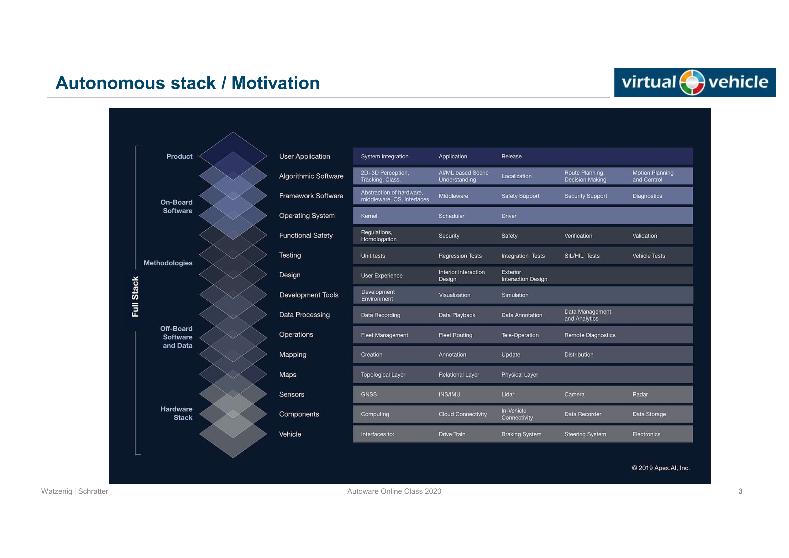
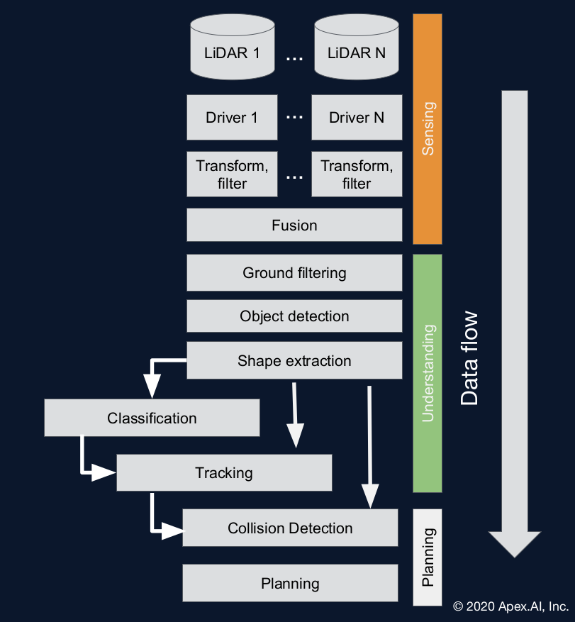
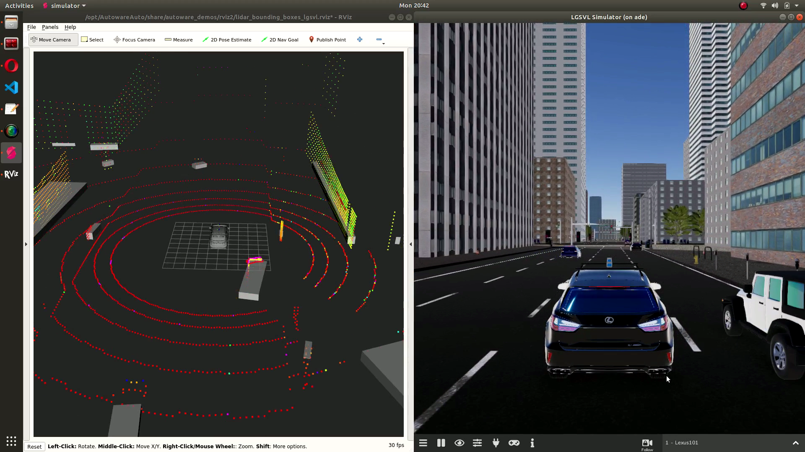

# Autoware_class20
Self-Driving Cars with ROS 2 and Autoware 

## Lectures

- MDs and PDF slides from [here](https://gitlab.com/ApexAI/autowareclass2020/-/tree/master/)

- Videos [here](https://www.autoware.org/awf-course)

# Building ADE
## Requirments
- Ubuntu 18.04
- Docker.ce, [installion](https://docs.docker.com/engine/install/ubuntu/).
- [Nvidia-container-runtime](https://github.com/NVIDIA/nvidia-container-runtime).

## Installation
Follow installtion [here](https://ade-cli.readthedocs.io/en/latest/install.html)

**Notes**

- After docker installtion, docker and `ade start` command should be started with root privileges 
so you should do:
```
sudo groupadd docker 
sudo usermod -aG docker $USER
reboot
```
  for more info, Check this [link](https://docs.docker.com/engine/install/linux-postinstall/)

- Disable secure boot from BIOS -> to avoid problems to Nvidia dirivers installtion
- Do `unset ADE_DISABLE_NVIDIA_DOCKER` and delete ADE_DISABLE_NVIDIA_DOCKER line from `~/AutowareAuto/.aderc` -> to avoid Rviz problems


## Demo 
First implemention of ADE by checking 3D perception stack
- [lecture 1](https://gitlab.com/ApexAI/autowareclass2020/-/blob/master/lectures/01_DevelopmentEnvironment/devenv.md)

[](http://www.youtube.com/watch?v=vzfrloH_Gs4 "Demo - Autoware.Auto 3D perception stack")

## Autonomous Stack

Autoware.Ai is like the skelton for Autowar.Auto. It contains the main software algorithms but supports ROS1.

Autowar.Auto is the next generation with more robust, clean and reliable code and supports ROS2.



## LGSVL simulator with ROS2 and Autoware.auto

First  LGSVL simulator implmentation with ADE


[](http://www.youtube.com/watch?v=SoF8SptJuPY "LGSVL simulator with ROS2 and Autoware.auto")

**Note**

**Bridging with Autoware.Auto**

LGSVL uses conventions which are not directly aligned with ROS 2 conventions. The full list of behaviors the lgsvl_interface implements is:

- Converts control inputs with CCW positive rotations to the CCW negative inputs the LGSVL simulator expects
- Provides a mapping from VehicleControlCommand to the RawControlCommand LGSVL expects via parametrizable 1D lookup tables
To run the lgsvl_interface, enter the following in a new terminal window:
```
$ ade enter
ade$ source /opt/AutowareAuto/setup.bash
ade$ ros2 run lgsvl_interface lgsvl_interface_exe __params:=/opt/AutowareAuto/share/lgsvl_interface/param/lgsvl.param.yaml
```

## Object Detection Stack

Autoware.Auto uses a classical object
detection stack:
- Simpler and more robust
- Geometric and optimization-based
methods for:
○ Ground filtering
○ Clustering
○ Shape Extraction



### Test



Documentation:
-https://autowarefoundation.gitlab.io/autoware.auto/AutowareAuto/lgsvl.html
- https://www.lgsvlsimulator.com/docs/vehicles-tab/#how-to-add-a-vehicle
- lgsvl-sensors.json file for vehicle configuration : https://gitlab.com/autowarefoundation/autoware.auto/AutowareAuto/-/blob/master/lgsvl-sensors.json 

Running command for Object detection:
ade$ source /opt/AutowareAuto/setup.bash
ade$ ros2 launch autoware_demos \
lidar_bounding_boxes_lgsvl.launch.py 

**Note:**

For the lgsvl bridge with ROS2 connection, `ros2-lgsvl-bridge` [package]( 
https://github.com/lgsvl/ros2-lgsvl-bridge)
should be cloned and build inside `~/adehome` and then restart ADE

[](http://www.youtube.com/watch?v=sfycsfp0pBA "Object Detection Test")
